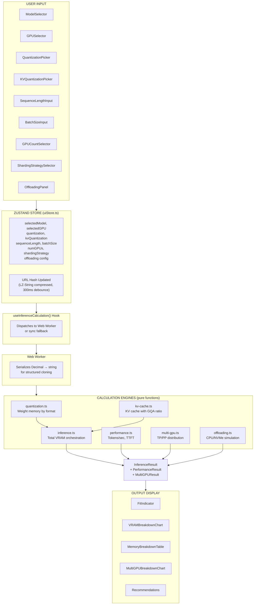
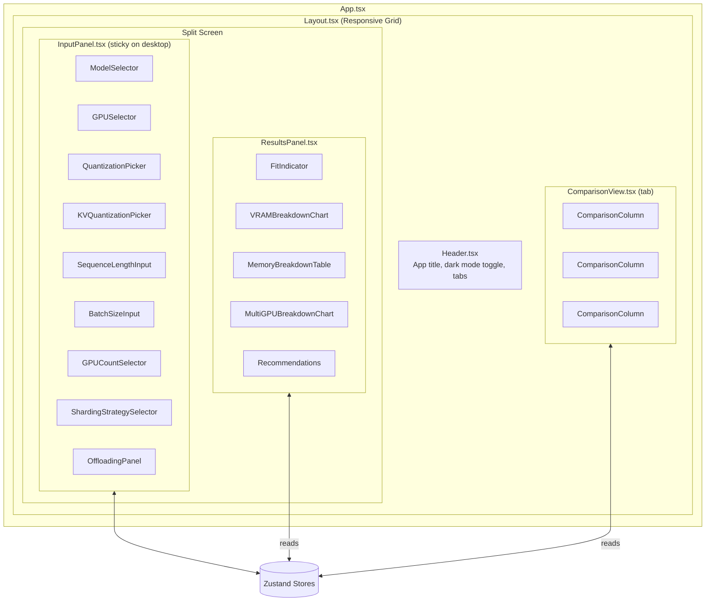

# LLM VRAM Calculator Architecture

> **IMPORTANT**: This document must be kept up-to-date when making architectural changes to the codebase.

## Overview

LLM VRAM Calculator is a browser-based Single Page Application (SPA) for estimating VRAM requirements and inference performance of large language models on various GPU configurations. It features a split-screen UI with configuration inputs on the left and real-time calculation results on the right. All calculations run client-side with no backend dependency.

## Technology Stack

| Technology | Version | Purpose |
|------------|---------|---------|
| React | 19.x | UI framework (Functional Components + Hooks) |
| TypeScript | 5.x | Type safety (Strict Mode, noUncheckedIndexedAccess) |
| Zustand | 5.x | State management with URL hash persistence |
| Tailwind CSS | 4.x | Responsive styling (class-based dark mode) |
| Vite | 7.x | Build tool |
| Recharts | 3.x | Donut chart and data visualization |
| Decimal.js | 10.x | Precision arithmetic for all calculations |
| LZ-String | 1.x | URL state compression |
| Zod | 3.x | Schema validation (single source of truth for types) |
| Biome | 2.x | Linting and formatting |
| Vitest | 4.x | Unit testing (jsdom environment) |

---

## Directory Structure

```
src/
├── engines/                    # Pure calculation logic (no React/DOM)
│   ├── quantization.ts         # Weight memory by quantization format
│   ├── kv-cache.ts             # KV cache memory with GQA/MQA support
│   ├── inference.ts            # Total inference VRAM (orchestrator)
│   ├── performance.ts          # Tokens/sec and TTFT estimation
│   ├── multi-gpu.ts            # Multi-GPU distribution and overhead
│   ├── offloading.ts           # CPU/RAM/NVMe offloading simulation
│   ├── constants.ts            # Shared constants (bytes per format)
│   ├── types.ts                # Engine-specific types
│   └── index.ts                # Barrel export
├── components/
│   ├── inputs/                 # Configuration controls
│   │   ├── ModelSelector.tsx    # Model search + custom model form
│   │   ├── GPUSelector.tsx      # GPU search + custom GPU form
│   │   ├── QuantizationPicker.tsx      # Weight quantization selector
│   │   ├── KVQuantizationPicker.tsx    # KV cache quantization selector
│   │   ├── SequenceLengthInput.tsx     # Log-scale slider (512-131K)
│   │   ├── BatchSizeInput.tsx          # Batch size (1-64)
│   │   ├── GPUCountSelector.tsx        # Number of GPUs (1-8)
│   │   ├── ShardingStrategySelector.tsx # Tensor/pipeline parallelism
│   │   └── OffloadingPanel.tsx         # CPU/NVMe offloading controls
│   ├── outputs/                # Result displays
│   │   ├── FitIndicator.tsx     # Fit/no-fit status with percentage
│   │   ├── VRAMBreakdownChart.tsx      # Recharts donut chart
│   │   ├── MemoryBreakdownTable.tsx    # Detailed memory table
│   │   ├── MultiGPUBreakdownChart.tsx  # Per-GPU memory distribution
│   │   └── Recommendations.tsx  # Actionable suggestions when model doesn't fit
│   ├── comparison/             # Configuration comparison
│   │   ├── ComparisonView.tsx   # Side-by-side comparison layout
│   │   └── ComparisonColumn.tsx # Individual snapshot column
│   ├── common/                 # Shared components
│   │   └── DarkModeToggle.tsx   # Theme switch
│   └── layout/                 # App structure
│       ├── Layout.tsx           # Root layout with responsive grid
│       ├── Header.tsx           # App header with nav
│       ├── InputPanel.tsx       # Left panel (sticky on desktop)
│       └── ResultsPanel.tsx     # Right panel (4 states: empty/loading/error/results)
├── store/                      # State management
│   ├── uiStore.ts              # Main Zustand store (selections, parameters)
│   ├── comparisonStore.ts      # Transient comparison snapshots (max 3, FIFO)
│   └── urlSerializer.ts        # URL hash encode/decode with LZ-String
├── hooks/                      # Custom React hooks
│   ├── useInferenceCalculation.ts  # Orchestrates Web Worker calculations
│   ├── useDarkMode.ts              # Dark mode state + classList sync
│   └── useURLSync.ts               # URL hash persistence with debounce
├── utils/                      # Shared utilities
│   ├── schemas.ts              # Zod schemas (GPU, Model) — type source of truth
│   ├── gpus.ts                 # GPU data loading and lookup helpers
│   └── models.ts               # Model data loading and lookup helpers
├── types/                      # TypeScript type re-exports
│   └── index.ts                # Re-exports z.infer<> types from schemas
├── workers/                    # Web Workers
│   └── calculation.worker.ts   # Offloads engine calculations to background thread
├── data/                       # Static databases
│   ├── gpus.json               # 19 curated GPUs (NVIDIA, AMD, Apple Silicon)
│   └── models.json             # 37 curated models (sorted alphabetically by name)
└── test/                       # Test infrastructure
    └── setup.ts                # @testing-library/jest-dom + cleanup
scripts/
├── fetch-models.ts             # Refresh model configs from HuggingFace API
└── fetch-gpus.ts               # Regenerate GPU database
```

---

## Data Flow



---

## Core Calculation Engines

All engines are **pure functions** using **Decimal.js** for precision arithmetic. They have no React/DOM dependencies, enabling Web Worker offloading and deterministic testing.

### Quantization Engine (`quantization.ts`)

Calculates model weight memory for 22 quantization formats:
- Standard: FP32 (4B), FP16 (2B), BF16 (2B), INT8 (1B), INT4 (0.5B), NF4 (0.5B)
- GPTQ/AWQ: Includes 1.2x overhead multiplier for group quantization metadata
- GGUF: Empirical bits-per-parameter from Artefact2 measurements (Q2_K through Q8_0)
- NVIDIA: NVFP4 (0.5B), NVFP6 (0.75B)

**Formula:** `weight_memory_GB = num_parameters × bytes_per_parameter / 1e9`

### KV Cache Engine (`kv-cache.ts`)

Calculates KV cache memory accounting for GQA/MQA architectures:

**Formula:** `kv_cache_GB = 2 × layers × hidden_size × seq_len × batch × precision × gqa_ratio / 1e9`

Where `gqa_ratio = num_kv_heads / num_attention_heads` (defaults to 1.0 for MHA)

Supports independent KV cache quantization (FP16, FP8, INT8, INT4).

### Inference Engine (`inference.ts`)

Orchestrates total VRAM calculation:

**Formula:** `total_VRAM = weights + kv_cache + activations + framework_overhead`

- Activations use FP32 (4 bytes) regardless of weight quantization
- Framework overhead: 1 GB (CUDA context + memory allocator)
- MoE models: total parameters for weights, active parameters for activations

### Performance Engine (`performance.ts`)

Estimates inference speed using the roofline model:

**Formula:** `tokens_per_sec = min(memory_bound, compute_bound)`

- Memory-bound: `bandwidth_GB/s / model_size_GB`
- Compute-bound: `FLOPS / (2 × params × 1e9)`
- TTFT: `0.5 × decode_speed` (2x slower prefill due to quadratic attention)
- 5% tolerance for bottleneck classification

### Multi-GPU Engine (`multi-gpu.ts`)

Distributes memory across GPUs with strategy-specific overhead:

**Tensor Parallelism:**
- Shards weights, KV cache, and activations across GPUs
- Replicates embeddings and layer norms (~3% of weights)
- NCCL buffers: 0.2 GB per peer GPU
- 12% communication overhead (15% for MoE due to expert routing)

**Pipeline Parallelism:**
- Assigns layer ranges to GPUs
- Does NOT divide KV cache (each GPU needs full context)
- 5% overhead, lower communication cost

### Offloading Engine (`offloading.ts`)

Simulates CPU/RAM and NVMe offloading:
- Calculates how much VRAM can be freed by offloading layers
- Estimates performance penalty based on PCIe/NVMe bandwidth
- Provides effective tokens/sec after offloading degradation

---

## State Management

### Zustand Store (`uiStore.ts`)

Single store with all calculator state:
- Model/GPU selection (ID or custom specs)
- Quantization format (weight + KV cache independently)
- Sequence length, batch size
- Multi-GPU config (count, sharding strategy)
- Offloading settings
- Dark mode preference (persisted to localStorage)

### URL Persistence (`urlSerializer.ts`)

- Serializes state to short key names (q, sl, bs, kvq, ng, ss)
- Compresses with LZ-String
- Stores in URL hash: `#<compressed-state>`
- 300ms debounce on updates
- Custom model/GPU serialize full parameters for complete restoration
- `deserializeFromURL` returns null on any failure (graceful degradation)

### Comparison Store (`comparisonStore.ts`)

- Transient session data (no persistence)
- Max 3 snapshots with FIFO eviction
- Supports add, remove, update label, clear
- Decimal-to-number conversion for serialization

---

## Type System

**Zod schemas** in `src/utils/schemas.ts` are the single source of truth:

```typescript
// Schema definition
export const GPUSchema = z.object({ ... })
export const ModelSchema = z.object({ ... })

// Type inference (no manual type definitions)
export type GPU = z.infer<typeof GPUSchema>
export type Model = z.infer<typeof ModelSchema>

// Validation helpers
export function validateGPU(data: unknown): GPU { ... }
export function validateModels(data: unknown): Model[] { ... }
```

Types in `src/types/` re-export from schemas. All data is validated through Zod at boundaries.

---

## Component Architecture



### Result States

`ResultsPanel.tsx` handles 4 states in priority order:
1. **No selection** — prompt to select model and GPU
2. **Loading** — spinner while Web Worker calculates
3. **Error** — inline error card + toast notification
4. **Results** — full VRAM breakdown, performance, recommendations

---

## Web Worker Architecture

### Message Protocol

```
Main Thread                    Worker Thread
    |                              |
    |-- { type, payload } -------->|
    |                              |-- runs engine calculations
    |                              |-- serializes Decimal → string
    |<-- { type, result } ---------|
    |                              |
```

- Worker uses **relative imports** (not path aliases) for Vite bundling
- Decimal.js values are serialized to strings for `postMessage` (structured cloning)
- Hook reconstructs Decimal instances from strings in the result
- **Sync fallback**: If Workers are unavailable (SSR, old browsers), calculations run on main thread via dynamic imports

---

## Key Files Reference

| File | Purpose |
|------|---------|
| `src/App.tsx` | Root component |
| `src/store/uiStore.ts` | Main Zustand store |
| `src/hooks/useInferenceCalculation.ts` | Calculation orchestration via Worker |
| `src/engines/inference.ts` | Core VRAM calculation |
| `src/engines/quantization.ts` | 22 quantization formats |
| `src/engines/multi-gpu.ts` | Multi-GPU distribution |
| `src/utils/schemas.ts` | Zod schemas (type source of truth) |
| `src/data/models.json` | 37 curated models (alphabetically sorted) |
| `src/data/gpus.json` | 19 curated GPUs |
| `src/store/urlSerializer.ts` | URL hash state persistence |
| `src/workers/calculation.worker.ts` | Background calculation thread |
