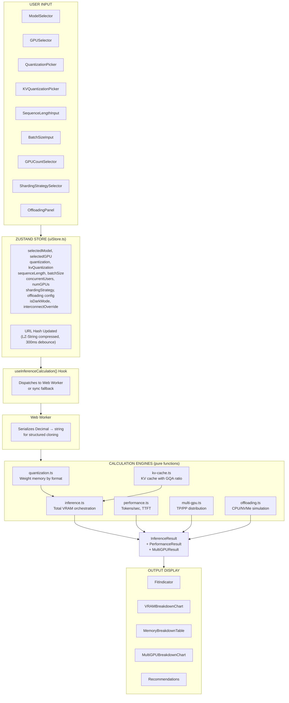
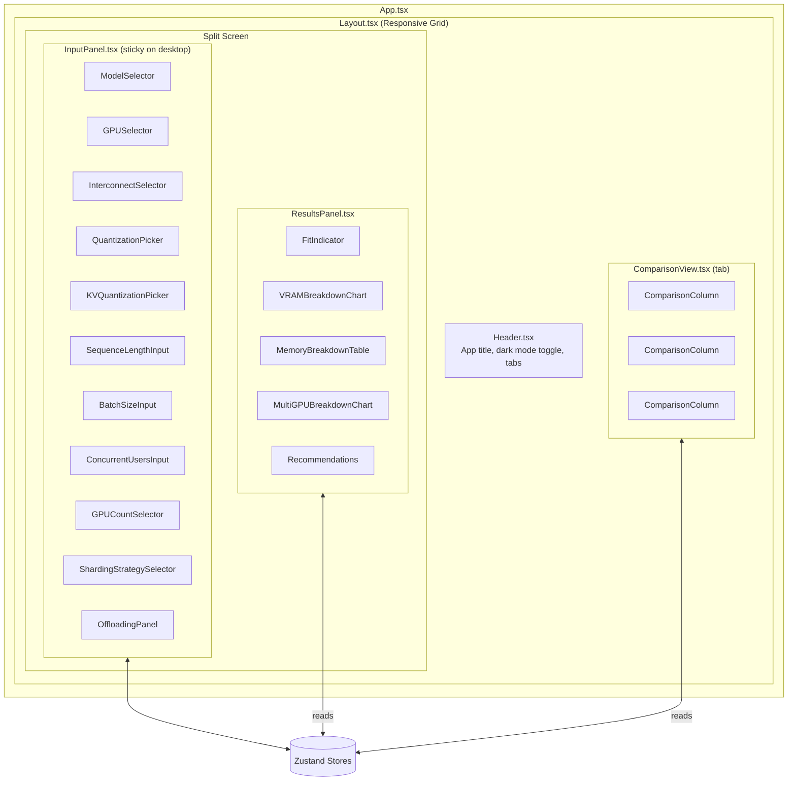

# LLM VRAM Calculator Architecture

> **IMPORTANT**: This document must be kept up-to-date when making architectural changes to the codebase.

## Overview

LLM VRAM Calculator is a browser-based Single Page Application (SPA) for estimating VRAM requirements and inference performance of large language models on various GPU configurations. It features a split-screen UI with configuration inputs on the left and real-time calculation results on the right. All calculations run client-side with no backend dependency.

## Technology Stack

| Technology | Version | Purpose |
|------------|---------|---------|
| React | 19.x | UI framework (Functional Components + Hooks) |
| TypeScript | 5.x | Type safety (Strict Mode, noUncheckedIndexedAccess) |
| Zustand | 5.x | State management with URL hash persistence |
| Tailwind CSS | 4.x | Responsive styling (class-based dark mode) |
| Vite | 7.x | Build tool |
| Recharts | 3.x | Donut chart and data visualization |
| Decimal.js | 10.x | Precision arithmetic for all calculations |
| LZ-String | 1.x | URL state compression |
| Zod | 4.x | Schema validation (single source of truth for types) |
| Biome | 2.x | Linting and formatting |
| Vitest | 4.x | Unit testing (jsdom environment) |

---

## Directory Structure

```
src/
├── engines/                    # Pure calculation logic (no React/DOM)
│   ├── quantization.ts         # Weight memory by quantization format
│   ├── kv-cache.ts             # KV cache memory with GQA/MQA support
│   ├── inference.ts            # Total inference VRAM (orchestrator)
│   ├── performance.ts          # Tokens/sec and TTFT estimation
│   ├── multi-gpu.ts            # Multi-GPU distribution and overhead
│   ├── offloading.ts           # CPU/RAM/NVMe offloading simulation
│   ├── constants.ts            # Shared constants (bytes per format)
│   ├── types.ts                # Engine-specific types
│   └── index.ts                # Barrel export
├── components/
│   ├── inputs/                 # Configuration controls
│   │   ├── ModelSelector.tsx    # Model search + custom model form
│   │   ├── GPUSelector.tsx      # GPU search + custom GPU form
│   │   ├── InterconnectSelector.tsx    # Interconnect variant picker (GPUs with multiple options)
│   │   ├── QuantizationPicker.tsx      # Weight quantization selector
│   │   ├── KVQuantizationPicker.tsx    # KV cache quantization selector
│   │   ├── SequenceLengthInput.tsx     # Log-scale slider (512-131K)
│   │   ├── BatchSizeInput.tsx          # Batch size (1-64)
│   │   ├── ConcurrentUsersInput.tsx    # Concurrent users (1-65,536) for KV cache sizing
│   │   ├── GPUCountSelector.tsx        # Number of GPUs, bounded by the selected GPU's max_gpus_per_node (1-72)
│   │   ├── ShardingStrategySelector.tsx # Tensor/pipeline parallelism
│   │   └── OffloadingPanel.tsx         # CPU/NVMe offloading controls
│   ├── outputs/                # Result displays
│   │   ├── FitIndicator.tsx     # Fit/no-fit status with percentage
│   │   ├── VRAMBreakdownChart.tsx      # Recharts donut chart
│   │   ├── MemoryBreakdownTable.tsx    # Detailed memory table
│   │   ├── MultiGPUBreakdownChart.tsx  # Per-GPU memory distribution
│   │   └── Recommendations.tsx  # Actionable suggestions when model doesn't fit
│   ├── comparison/             # Configuration comparison
│   │   ├── ComparisonView.tsx   # Side-by-side comparison layout
│   │   └── ComparisonColumn.tsx # Individual snapshot column
│   ├── common/                 # Shared components
│   │   └── DarkModeToggle.tsx   # Theme switch
│   └── layout/                 # App structure
│       ├── Layout.tsx           # Root layout with responsive grid
│       ├── Header.tsx           # App header with nav
│       ├── InputPanel.tsx       # Left panel (sticky on desktop)
│       └── ResultsPanel.tsx     # Right panel (4 states: empty/loading/error/results)
├── store/                      # State management
│   ├── uiStore.ts              # Main Zustand store (selections, parameters)
│   ├── comparisonStore.ts      # Transient comparison snapshots (max 3, FIFO)
│   └── urlSerializer.ts        # URL hash encode/decode with LZ-String
├── hooks/                      # Custom React hooks
│   ├── useInferenceCalculation.ts  # Orchestrates Web Worker calculations
│   ├── useDarkMode.ts              # Dark mode state + classList sync
│   └── useURLSync.ts               # URL hash persistence with debounce
├── utils/                      # Shared utilities
│   ├── schemas.ts              # Zod schemas (GPU, Model) — type source of truth
│   ├── exportPptx.ts           # PPTX export (pptxgenjs) — VRAM/perf/config slides
│   ├── gpus.ts                 # GPU data loading and lookup helpers
│   └── models.ts               # Model data loading and lookup helpers
├── types/                      # TypeScript type re-exports
│   └── index.ts                # Re-exports z.infer<> types from schemas
├── workers/                    # Web Workers
│   └── calculation.worker.ts   # Offloads engine calculations to background thread
├── data/                       # Static databases
│   ├── gpus.json               # 28 curated GPUs (NVIDIA, AMD, Apple Silicon) + spec_url
│   └── models.json             # 54 curated models (sorted alphabetically by name) + context_length, license, hf_url
└── test/                       # Test infrastructure
    └── setup.ts                # @testing-library/jest-dom + cleanup
scripts/
├── fetch-models.ts             # Refresh model configs from HuggingFace API
└── fetch-gpus.ts               # Regenerate GPU database
```

---

## Data Flow


```mermaid
flowchart TB
    subgraph Input["USER INPUT"]
        ModelSelector
        GPUSelector
        QuantPicker["QuantizationPicker"]
        KVQuant["KVQuantizationPicker"]
        SeqLen["SequenceLengthInput"]
        BatchSize["BatchSizeInput"]
        GPUCount["GPUCountSelector"]
        Sharding["ShardingStrategySelector"]
        Offload["OffloadingPanel"]
    end

    subgraph Store["ZUSTAND STORE (uiStore.ts)"]
        State["selectedModel, selectedGPU\nquantization, kvQuantization\nsequenceLength, batchSize\nconcurrentUsers, numGPUs\nshardingStrategy, offloading config\nisDarkMode, interconnectOverride"]
        URL["URL Hash Updated\n(LZ-String compressed, 300ms debounce)"]
    end

    subgraph Hook["useInferenceCalculation() Hook"]
        Dispatch["Dispatches to Web Worker\nor sync fallback"]
    end

    subgraph Worker["Web Worker"]
        Serialize["Serializes Decimal → string\nfor structured cloning"]
    end

    subgraph Engines["CALCULATION ENGINES (pure functions)"]
        Quant["quantization.ts\nWeight memory by format"]
        KV["kv-cache.ts\nKV cache with GQA ratio"]
        Infer["inference.ts\nTotal VRAM orchestration"]
        Perf["performance.ts\nTokens/sec, TTFT"]
        Multi["multi-gpu.ts\nTP/PP distribution"]
        Off["offloading.ts\nCPU/NVMe simulation"]
    end

    Results["InferenceResult\n+ PerformanceResult\n+ MultiGPUResult"]

    subgraph Output["OUTPUT DISPLAY"]
        Fit["FitIndicator"]
        Chart["VRAMBreakdownChart"]
        Table["MemoryBreakdownTable"]
        MGChart["MultiGPUBreakdownChart"]
        Recs["Recommendations"]
    end

    Input --> Store
    Store --> Hook
    Hook --> Worker
    Worker --> Engines
    Quant --> Infer
    KV --> Infer
    Infer --> Results
    Perf --> Results
    Multi --> Results
    Off --> Results
    Results --> Output
```

---

## Core Calculation Engines

All engines are **pure functions** using **Decimal.js** for precision arithmetic. They have no React/DOM dependencies, enabling Web Worker offloading and deterministic testing.

### Quantization Engine (`quantization.ts`)

Calculates model weight memory for 24 quantization formats:

- Standard: FP32 (4B), FP16 (2B), BF16 (2B), FP8 (1B), INT8 (1B), INT4 (0.5B), NF4 (0.5B)
- MXFP4 (0.53125B: 4-bit values plus one 8-bit scale per 32), NVFP4 (0.5B), NVFP6 (0.75B)
- GPTQ/AWQ: Includes 1.2x overhead multiplier for group quantization metadata
- GGUF: Empirical bits-per-parameter from Artefact2 measurements (Q2_K through Q8_0)

**Formula:** `weight_GB = params × effectiveBytesPerParameter(format, model) / 1024³`

`effectiveBytesPerParameter` returns the measured `weight_refs[format].gib × 1024³ / (params × 1e9)` when the model has a reference checkpoint for the format (what stays 16-bit depends on the recipe, so each format is measured), else `BYTES_PER_PARAMETER[format]` (INT4 0.5625, AWQ/GPTQ 0.52, NVFP4 0.5625, GGUF from measured bpp).

### KV Cache Engine (`kv-cache.ts`)

**Formula:** `kv_bytes = (full_elements × seq_len + sliding_elements × min(window, seq_len)) × concurrentUsers × precision`

- `full_elements` is `kv_cache_elements_per_token` when the model has it (MLA, hybrid, explicit head_dim), else `2 × layers × hidden × num_kv_heads / num_attention_heads`.
- `sliding_elements` / `window` are `kv_sliding_elements_per_token` / `kv_sliding_window` (Gemma 3/4, gpt-oss, Llama 4, DeepSeek V4), allocated at `min(window, context)` as vLLM does.
- These values are known-good (what vLLM allocates, confirmed by a second source), never re-derived by hand.
- `linear_state_bytes_per_session` (hybrid models) adds a constant conv + recurrent state per session; `InferenceVRAMBreakdown.linearState` carries it so tensor parallelism can split it across every GPU while KV keeps its head floor.
- `concurrentUsers` (1-65,536) replaces `batchSize` so the estimate covers every resident session.

Supports independent KV cache quantization (FP16, FP8, INT8, INT4).

### Inference Engine (`inference.ts`)

Orchestrates total VRAM calculation:

**Formula:** `total_VRAM = weights + kv_cache + activations + framework_overhead`

- Activations use FP32 (4 bytes) regardless of weight quantization
- Framework overhead: 1 GB per process (CUDA context + memory allocator); multi-GPU charges it once per GPU, never summed across the cluster
- MoE models: total parameters for weights, active parameters for activations

### Performance Engine (`performance.ts`)

One decode step produces one token for each of `batchSize` sequences:

- **Memory:** `bytes_per_GPU = (weights_read / tp + batch × kv_per_seq / kv_shards) / stages`, then `/ bandwidth`. Weights use active (batched) parameters for MoE; KV is read at the full context.
- **Compute:** `batch × (2 × active_params + 4 × layers × context × hidden) / (tp × stages × FLOPS)`. An aggregate ceiling, never multiplied by batch.
- **Step:** `max(memory, compute) + 2 × layers / stages × allreduceLatencyUs` (tensor parallelism only; NVLink 11 µs, Infinity Fabric 20 µs, PCIe 25 µs estimate).
- **Tokens/sec:** `batch / step × B / (B + stages − 1) × interNodeDecodeEfficiency`. A decode token cannot be split into micro-batches, so pipeline parallelism gives no speedup at batch 1.
- **TTFT:** prefill FLOPs (`2 × active × T` + `2 × layers × T² × hidden`) / (FLOPS × PREFILL_MFU × numGPUs × prefillScalingEfficiency), plus one decode step.
- 5% tolerance for bottleneck classification.

### Concurrency (`concurrency.ts`)

- Per-user tok/s = aggregate / users; per-user TTFT waits for the batches ahead.
- `maxConcurrentSessions`: `floor((0.9 × VRAM − fixed_per_GPU) / (kv_per_GPU / users))`, fixed = per-GPU total − per-GPU KV. Mirrors vLLM's "Maximum concurrency" (`gpu_memory_utilization` 0.9). Every engine is linear in sessions, so the displayed breakdown gives both terms for any strategy.

### KV Storage Tier (`kv-tier.ts`)

- Parked sessions hold no HBM; memory and decode engines are unchanged.
- Sessions held = `min(floor(maxConcurrentSessions / activeShare), maxConcurrentSessions + capacityTB × 1000 / kv_per_session)`: capacity bounds parked sessions only.
- Units: engine KV is GiB (1024³ bytes, like `vram_gb`); tier capacity and bandwidth are decimal, so KV is converted (× 1.0737) before dividing.
- `sessionKVLayout`: under TP/PP every GPU reloads its share of a session in parallel; under EP a session lives on one rank per node (N × the per-GPU average) and reloads through that link.
- Resume = 0.03 s + KV per session per GPU / tier GB/s per GPU; compared with `prefillSeconds`.
- Traffic = held × activeShare / burstSeconds × KV per session per GPU × GPUs per session (duplicated MLA fetched per TP rank, conservative), against tier GB/s × GPUs.
- No Dell Lightning FS preset: it targets > 16K GPUs (cluster storage sizing, raidy).

### Multi-GPU Engine (`multi-gpu.ts`)

Distributes memory the way vLLM allocates it. Requires a `GPU` object to resolve the interconnect.

**Tensor Parallelism:**

- Shards weights and activations across GPUs; embeddings and the LM head shard too (`VocabParallelEmbedding`). Only layer norms are replicated.
- KV splits `min(numGPUs, num_kv_heads)` ways (`max(1, kv_heads // tp)` heads per GPU). MLA models (`use_mla`) keep the full latent cache on every GPU.
- Each GPU pays one 1 GB framework context; `communicationOverhead` is the NCCL buffers (0.25 GB, flat per GPU).
- Interconnect efficiency (`tpScalingEfficiency`) is a throughput cost: it feeds `scalingEfficiency` / `prefillScalingEfficiency`, never memory.

**Expert Parallelism + DP attention (MoE only):**

- `splitMoEParams` separates routed experts from the base; routed weights divide by N, the base is replicated (vLLM: attention replicated across DP ranks when TP = 1).
- KV divides by N: each GPU holds only its own sessions, with no MLA duplication.
- Decode reads the base in full plus 1/N of the touched experts; each MoE layer pays `expertAllToAllSeconds` (FP8 dispatch + BF16 combine over one link direction, plus two latencies).

**Pipeline Parallelism:**

- Assigns contiguous layer ranges to GPUs; weights, KV cache and activations divide by the stage count (activations +12% stashing).
- No NCCL buffers; `communicationOverhead` is 0.
- Across servers, nodes are always pipeline stages (`multi-node.ts`).

### Offloading Engine (`offloading.ts`)

Simulates CPU/RAM and NVMe offloading:

- Calculates how much VRAM can be freed by offloading layers
- Estimates performance penalty based on PCIe/NVMe bandwidth
- Provides effective tokens/sec after offloading degradation

---

## State Management

### Zustand Store (`uiStore.ts`)

Single store with all calculator state:

- Model/GPU selection (ID or custom specs)
- Quantization format (weight + KV cache independently)
- Sequence length, batch size
- Multi-GPU config (count, sharding strategy)
- Offloading settings
- Concurrent users count (1–65,536)
- Interconnect override for GPUs with multiple options
- Dark mode preference: defaults to `prefers-color-scheme` on first visit, tracks live OS changes via `matchMedia`, persisted to localStorage

### URL Persistence (`urlSerializer.ts`)

- Serializes state to short key names (q, sl, bs, kvq, ng, ss)
- Compresses with LZ-String
- Stores in URL hash: `#<compressed-state>`
- 300ms debounce on updates
- Custom model/GPU serialize full parameters for complete restoration
- `deserializeFromURL` returns null on any failure (graceful degradation)

### Comparison Store (`comparisonStore.ts`)

- Transient session data (no persistence)
- Max 3 snapshots with FIFO eviction
- Supports add, remove, update label, clear
- Decimal-to-number conversion for serialization

---

## Type System

**Zod schemas** in `src/utils/schemas.ts` are the single source of truth:

```typescript
// Schema definition
export const GPUSchema = z.object({ ... })
export const ModelSchema = z.object({ ... })

// Type inference (no manual type definitions)
export type GPU = z.infer<typeof GPUSchema>
export type Model = z.infer<typeof ModelSchema>

// Validation helpers
export function validateGPU(data: unknown): GPU { ... }
export function validateModels(data: unknown): Model[] { ... }
```

Types in `src/types/` re-export from schemas. All data is validated through Zod at boundaries.

### Optional metadata fields

Both schemas include optional display/linking fields that do not affect calculations:

| Schema | Field | Type | Purpose |
|--------|-------|------|---------|
| `ModelSchema` | `context_length` | `number` | Max token context (shown in selector) |
| `ModelSchema` | `license` | `string` | License identifier (shown in selector) |
| `ModelSchema` | `hf_url` | `string (URL)` | HuggingFace model card link |
| `GPUSchema` | `spec_url` | `string (URL)` | Vendor spec sheet link |

---

## Component Architecture


```mermaid
flowchart TB
    subgraph App["App.tsx"]
        subgraph LayoutComp["Layout.tsx (Responsive Grid)"]
            Header["Header.tsx\nApp title, dark mode toggle, tabs"]
            subgraph Split["Split Screen"]
                subgraph Left["InputPanel.tsx (sticky on desktop)"]
                    MS["ModelSelector"]
                    GS["GPUSelector"]
                    IS["InterconnectSelector"]
                    QP["QuantizationPicker"]
                    KVQ["KVQuantizationPicker"]
                    SL["SequenceLengthInput"]
                    BS["BatchSizeInput"]
                    CU["ConcurrentUsersInput"]
                    GC["GPUCountSelector"]
                    SS["ShardingStrategySelector"]
                    OP["OffloadingPanel"]
                end
                subgraph Right["ResultsPanel.tsx"]
                    FI["FitIndicator"]
                    VBC["VRAMBreakdownChart"]
                    MBT["MemoryBreakdownTable"]
                    MGBC["MultiGPUBreakdownChart"]
                    Recs["Recommendations"]
                end
            end
            subgraph Comparison["ComparisonView.tsx (tab)"]
                CC1["ComparisonColumn"]
                CC2["ComparisonColumn"]
                CC3["ComparisonColumn"]
            end
        end
    end

    Store[(Zustand Stores)]
    Left <--> Store
    Right <-- reads --> Store
    Comparison <-- reads --> Store
```

### Result States

`ResultsPanel.tsx` handles 4 states in priority order:

1. **No selection** — prompt to select model and GPU
2. **Loading** — spinner while Web Worker calculates
3. **Error** — inline error card + toast notification
4. **Results** — full VRAM breakdown, performance, recommendations

---

## Web Worker Architecture

### Message Protocol

```
Main Thread                    Worker Thread
    |                              |
    |-- { type, payload } -------->|
    |                              |-- runs engine calculations
    |                              |-- serializes Decimal → string
    |<-- { type, result } ---------|
    |                              |
```

- Worker uses **relative imports** (not path aliases) for Vite bundling
- Decimal.js values are serialized to strings for `postMessage` (structured cloning)
- Hook reconstructs Decimal instances from strings in the result
- **Sync fallback**: If Workers are unavailable (SSR, old browsers), calculations run on main thread via dynamic imports

---

## Key Files Reference

| File | Purpose |
|------|---------|
| `src/App.tsx` | Root component |
| `src/store/uiStore.ts` | Main Zustand store |
| `src/hooks/useInferenceCalculation.ts` | Calculation orchestration via Worker |
| `src/engines/inference.ts` | Core VRAM calculation |
| `src/engines/quantization.ts` | 22 quantization formats |
| `src/engines/multi-gpu.ts` | Multi-GPU distribution |
| `src/utils/schemas.ts` | Zod schemas (type source of truth) |
| `src/data/models.json` | 54 curated models (alphabetically sorted) |
| `src/data/gpus.json` | 28 curated GPUs |
| `src/store/urlSerializer.ts` | URL hash state persistence |
| `src/workers/calculation.worker.ts` | Background calculation thread |
